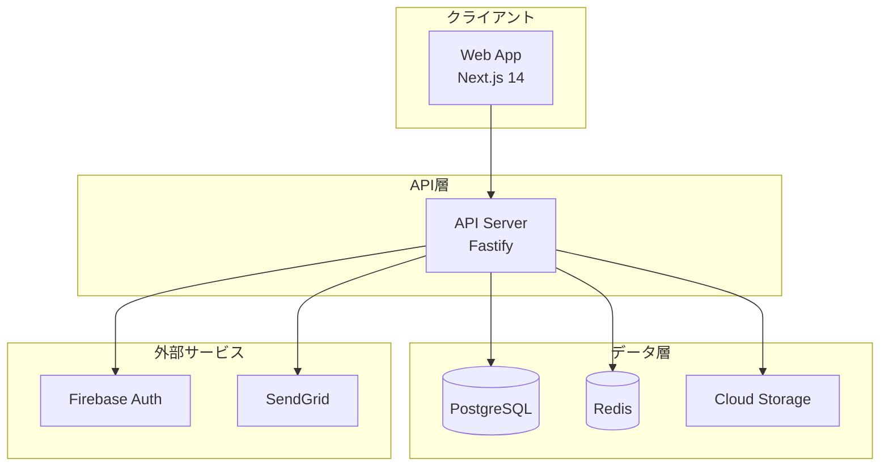
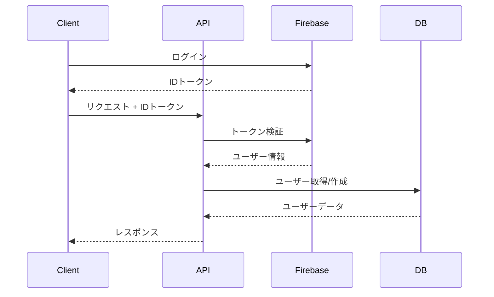
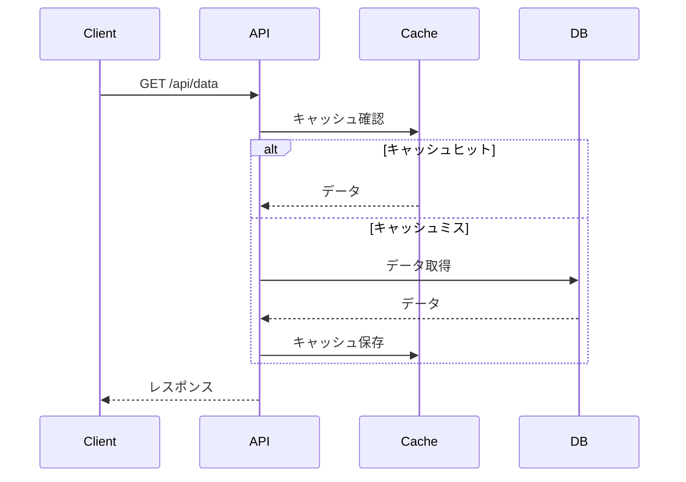

# システムアーキテクチャ

## 概要

このプロジェクトは、モダンなフルスタックアプリケーション開発のためのモノリポテンプレートです。



## 技術スタック

### フロントエンド

- **フレームワーク**: Next.js 14 (App Router)
- **言語**: TypeScript
- **スタイリング**: Tailwind CSS
- **状態管理**: React Context / Zustand
- **データフェッチ**: SWR / TanStack Query
- **フォーム**: React Hook Form + Zod

### バックエンド

- **フレームワーク**: Fastify
- **言語**: TypeScript
- **ORM**: Prisma
- **バリデーション**: Zod
- **認証**: JWT + Firebase Auth
- **API仕様**: OpenAPI 3.0

### インフラストラクチャ

- **クラウド**: Google Cloud Platform
- **コンテナ**: Docker
- **オーケストレーション**: Cloud Run
- **データベース**: Cloud SQL (PostgreSQL)
- **ストレージ**: Cloud Storage
- **CDN**: Cloud CDN

### 開発ツール

- **パッケージマネージャー**: pnpm
- **モノリポ管理**: Turborepo
- **リンター**: ESLint
- **フォーマッター**: Prettier
- **テスト**: Jest + Testing Library
- **CI/CD**: GitHub Actions

## アーキテクチャパターン

### 1. モノリポ構成

```
project/
├── apps/
│   ├── api/          # API サーバー
│   └── web/          # Web アプリケーション
├── packages/
│   ├── api-client/   # 自動生成APIクライアント
│   ├── database/     # Prisma クライアント
│   ├── types/        # 共有型定義
│   ├── ui/           # UIコンポーネント
│   └── utils/        # ユーティリティ関数
└── infrastructure/   # インフラ設定
```

### 2. レイヤードアーキテクチャ (API)

```
api/
├── src/
│   ├── controllers/  # HTTPリクエストハンドラ
│   ├── services/     # ビジネスロジック
│   ├── repositories/ # データアクセス層
│   ├── domain/       # ドメインモデル
│   └── middleware/   # 認証・ロギング等
```

### 3. Feature-based構成 (Web)

```
web/
├── app/
│   ├── (auth)/      # 認証が必要なルート
│   ├── (public)/    # 公開ルート
│   └── api/         # API ルート
├── components/
│   ├── features/    # 機能別コンポーネント
│   └── ui/          # 共通UIコンポーネント
└── lib/             # ユーティリティ
```

## データフロー

### 1. 認証フロー



### 2. データ取得フロー



## セキュリティ

### 認証・認可

- Firebase Authentication による認証
- JWT トークンベースの認可
- Role-Based Access Control (RBAC)

### API セキュリティ

- CORS 設定
- Rate Limiting
- Request Validation (Zod)
- SQL Injection 対策 (Prisma)

### インフラセキュリティ

- HTTPS 強制
- Cloud Armor (DDoS対策)
- Secret Manager (機密情報管理)
- VPC ネットワーク分離

## パフォーマンス最適化

### フロントエンド

- Server Components の活用
- 画像最適化 (Next.js Image)
- Code Splitting
- Prefetching
- Service Worker

### バックエンド

- データベースインデックス
- クエリ最適化
- Redis キャッシング
- Connection Pooling

### インフラ

- CDN 活用
- Auto Scaling
- Load Balancing
- Health Checks

## 監視・ロギング

### アプリケーション監視

- エラートラッキング (Sentry)
- パフォーマンス監視
- ユーザー行動分析

### インフラ監視

- Cloud Monitoring
- Cloud Logging
- アラート設定
- ダッシュボード

## 開発プロセス

### ブランチ戦略

- GitHub Flow
- main ブランチのみ
- Pull Request ベース

### CI/CD パイプライン

1. コードプッシュ
2. 自動テスト実行
3. ビルド
4. ステージング環境デプロイ
5. 本番環境デプロイ（承認後）

### 環境

- **開発**: ローカル環境
- **ステージング**: 本番環境の複製
- **本番**: プロダクション環境
